# Django CarService #

web service based on Django web framework. The "CarService" allows you to connect different service stations with a
unique
work schedule.
And also allows ordinary users to make an appointment at a convenient time for a visit to get their car serviced.

# Built on #

* Django 4.1
* Python 3.10

# Business processes: #

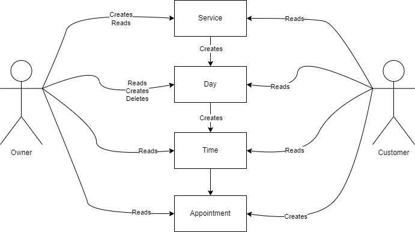

# ERD: #

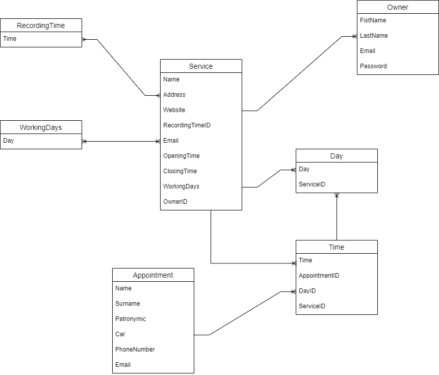

# Screenshots #

Want to see the interface of the site? Check it out!

|                                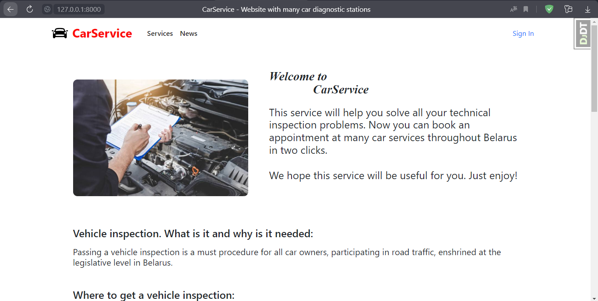 Homepage                                 |                     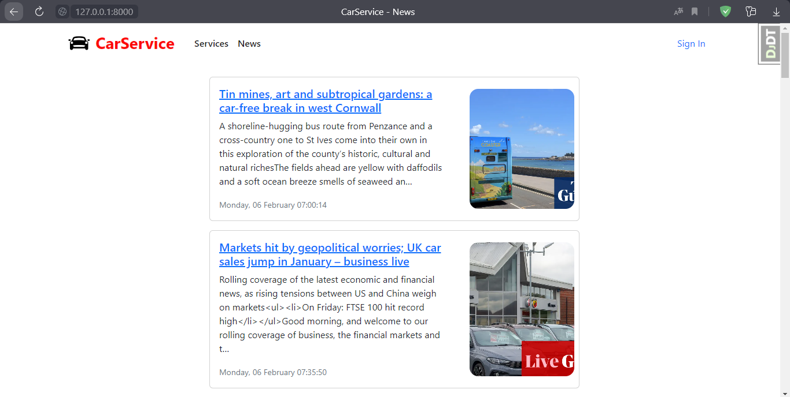   News page(shows 20 latest current news)                     | 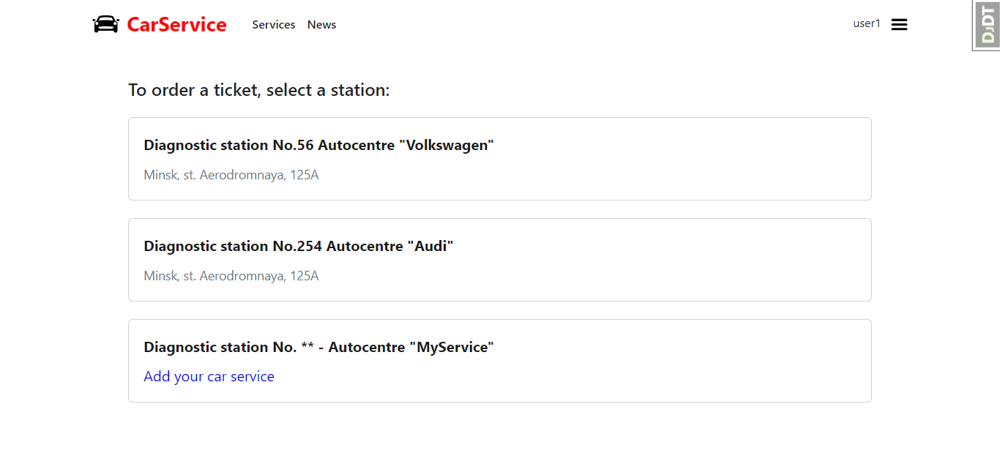    Service catalog and the ability to connect your own service |
|:--------------------------------------------------------------------------------------------:|:------------------------------------------------------------------------------------------------------:|:-------------------------------------------------------------------------------------------:|
|                      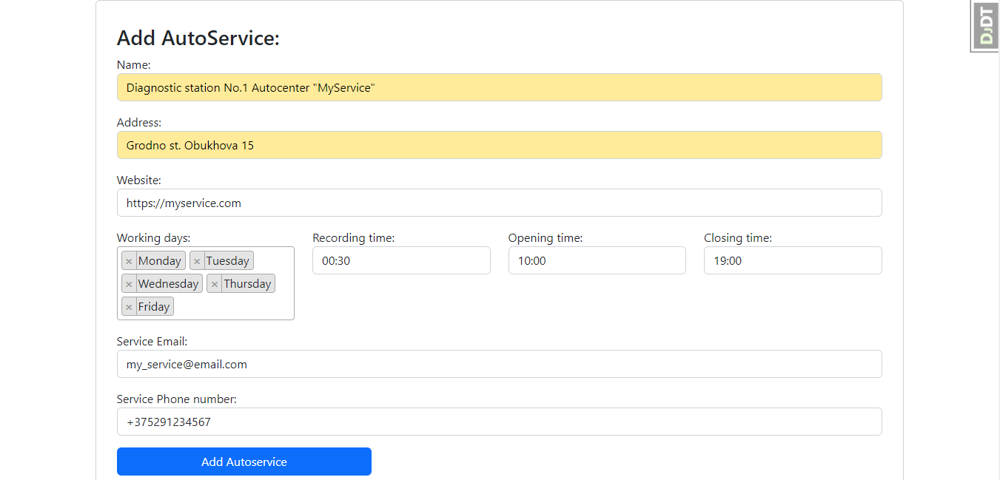    Adding your service                      |                   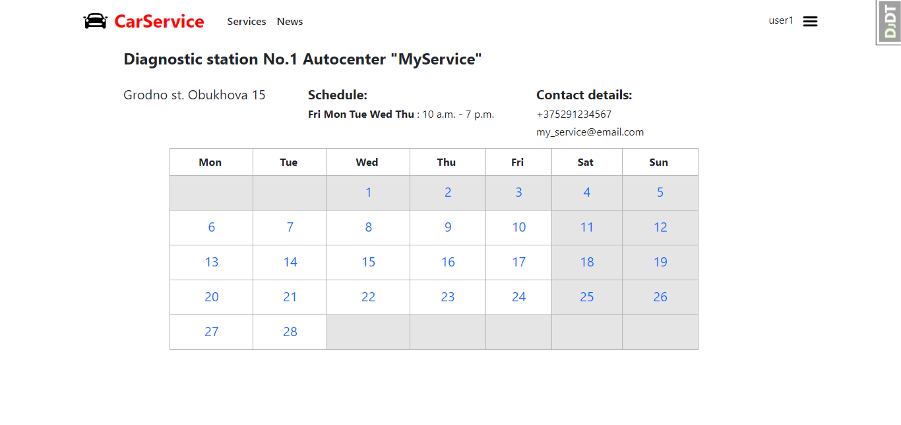    Pick date via service owner                   |                 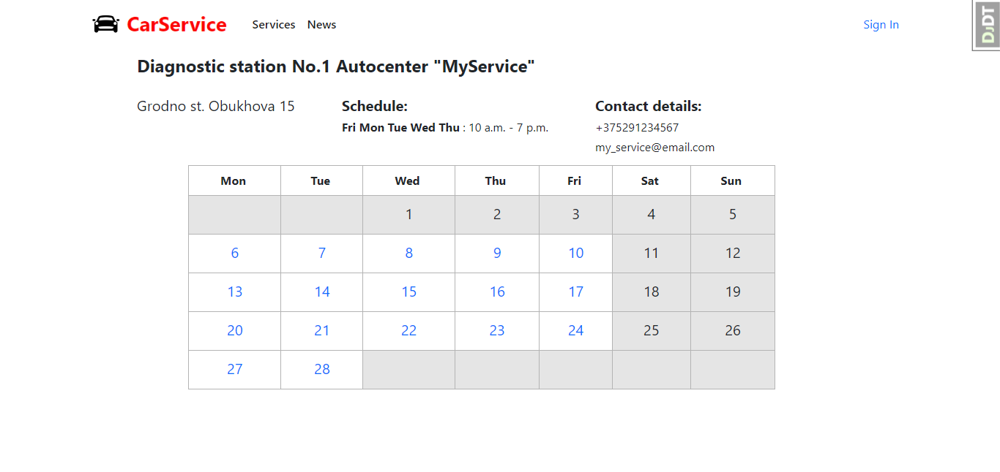   Pick date via visitor                  |
|        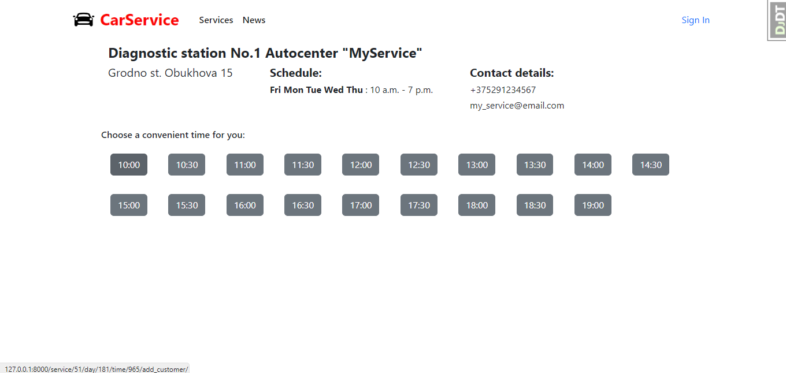   Picking a convenient time via visitor         |                     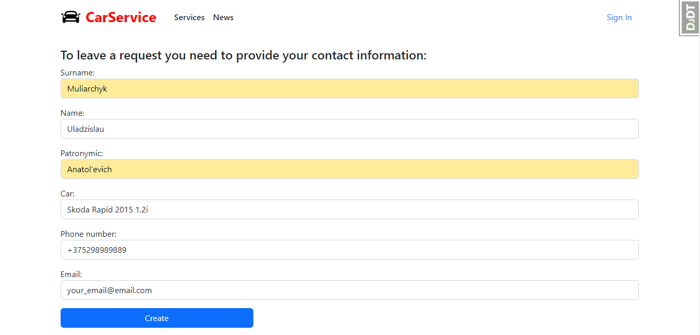  Leaving an application                     |                            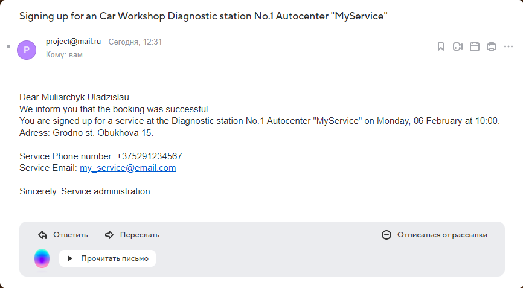   Email to user                            |
| 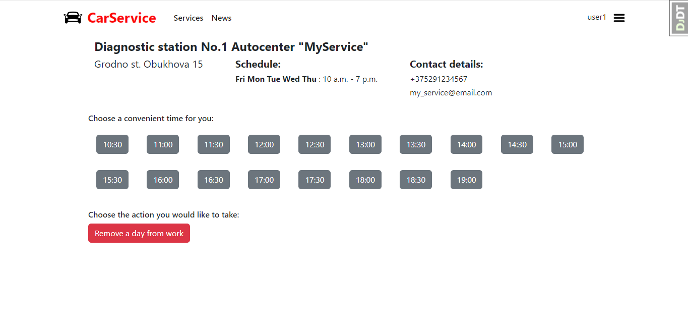  Time selection through the service author | 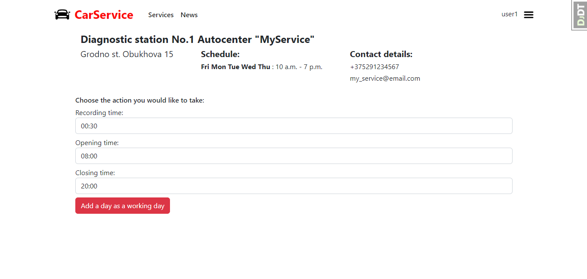  Time selection for non-working day through the service author |      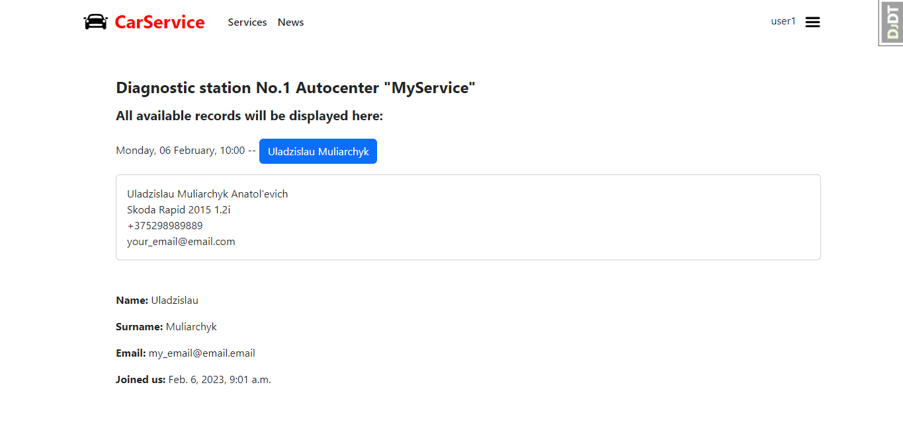  View profile with connected service      |